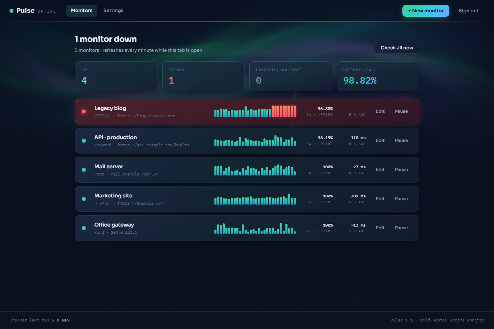
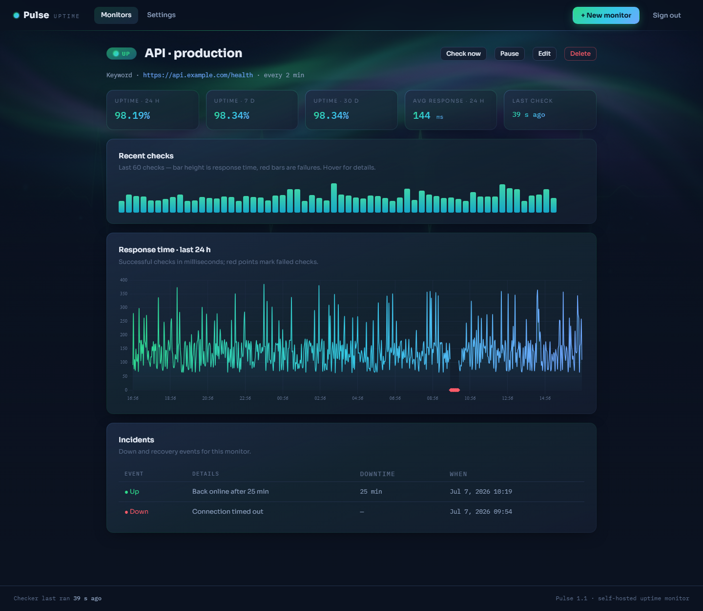
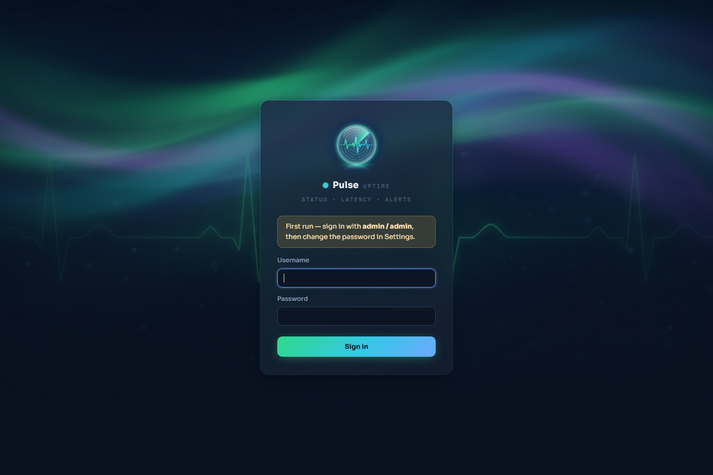

# Pulsar — self-hosted uptime monitor

A lightweight, self-hosted uptime monitor in the spirit of UptimeRobot: watch your websites, APIs, and servers, and get alerted on **Telegram**, **Pushover**, or **email** the moment something goes down — and again when it recovers.

Built in plain **PHP + SQLite**. No Composer, no build step, no external services. Copy the folder onto any PHP host and open it in a browser.



## Features

### Monitoring

| Check type | What it does |
|------------|--------------|
| **HTTP(s)** | Requests a URL and judges the response status code. Configurable method (GET / HEAD / POST), accepted status codes (ranges and lists, e.g. `200-299, 301, 401`), redirect following (up to 10 hops), and SSL certificate verification — an expired or invalid certificate counts as down. |
| **Keyword** | Fetches a page and alerts when a keyword is **missing** (something that should be there, like `"status":"ok"`) or **present** (something that shouldn't, like an error message). Case-insensitive. |
| **Ping** | ICMP ping to a host or IP. Works on Windows and Linux hosts. |
| **Port** | TCP connect to any `host:port` — mail servers, databases, game servers, SSH. |

Every monitor has its own:

- **Check interval** — from every minute to every hour
- **Timeout** — 1–120 seconds
- **Down confirmation** — require 1, 2, 3, or 5 consecutive failed checks before declaring an incident, so a single network blip doesn't page you at 3 AM
- **Repeat reminders** — optionally re-alert every N checks while a monitor stays down
- **Recovery notification** — a follow-up alert when the monitor comes back, including how long it was down

Monitors can be **paused and resumed** at any time, checked on demand ("Check now" / "Check all now"), edited, or deleted with their history.

### Alerting

Three notification channels, configured once in Settings and toggled per monitor:

- **Telegram** — via a bot you create with [@BotFather](https://t.me/BotFather); works with private chats, groups, and channels
- **Pushover** — native push notifications to your phone via [Pushover](https://pushover.net); supports group keys, and down alerts can optionally be sent high-priority to bypass quiet hours (recovery alerts stay normal)
- **Email** — through any SMTP server (SSL or STARTTLS, e.g. a Gmail app password) or PHP `mail()`; the SMTP client is built in, no libraries needed. Per-monitor recipient lists with a global default fallback

Each channel has a **"save & send test"** button so you can confirm delivery before an outage does it for you.

### Dashboard & history



- **Live dashboard** with up/down/paused counts, overall 24 h uptime, and per-monitor *signal strips* — the recent check history drawn as bars where height is response time and red marks failures
- **Monitor detail pages** with uptime for 24 h / 7 d / 30 d, average response time, a 24-hour response-time chart, and a full **incident log** (every down and recovery event with downtime duration)
- Auto-refreshes every minute while a tab is open
- Check history is kept for a configurable 7–365 days and pruned automatically

### Under the hood

- **SQLite database, zero setup** — created automatically on first visit, schema migrations run automatically on upgrade
- **Single admin account** with hashed password, session login, and CSRF protection on every form; the database directory is blocked from the web
- **Three ways to run the checker** (see [Keeping checks running](#keeping-checks-running-247))
- Timezone selection and history retention configurable in Settings

## Requirements

- **PHP 7.0 or newer** — tested on PHP 7.0.33 and 8.3, so it runs on virtually any hosting, from modern VPSes to old shared hosts
- PHP extensions: `pdo_sqlite`, `curl`, `openssl` (enabled by default almost everywhere)
- Any web server that runs PHP: Apache, nginx + PHP-FPM, IIS, or PHP's built-in server
- For Ping monitors: permission to execute the system `ping` command (`exec()` not disabled)

No database server, no Composer, no Node, no cron daemon strictly required.

## Installation

1. Copy the project folder into your web root (or clone the repository there).
2. Make sure the `data/` directory is **writable** by the web server — the SQLite database lives there.
3. Open the app in your browser and sign in with the default credentials:
   - Username: `admin`
   - Password: `admin`

   
4. **Change the password** in *Settings → Account* (the app reminds you until you do).
5. Add your first monitor with **+ New monitor**.

On Apache, the bundled `data/.htaccess` already blocks web access to the database. On **nginx**, add the equivalent yourself:

```nginx
location ~ ^/path-to-pulsar/data/ { deny all; }
```

## Keeping checks running 24/7

Checks are due on each monitor's own schedule; something needs to trigger the checker every minute. Any **one** of these works:

| Method | How | Good for |
|--------|-----|----------|
| **Open browser tab** | Nothing to set up — while any Pulsar tab is open, the checker ticks automatically every minute | Trying it out, office dashboards |
| **System scheduler** | Run `php /path/to/pulsar/cron.php` every minute via cron (Linux) or Task Scheduler (Windows) | Servers you control |
| **Web cron** | Point a service like cron-job.org at the secret keyed URL shown in *Settings → Background checker* | Shared hosting without shell access |

Linux crontab example:

```cron
* * * * * php /var/www/pulsar/cron.php >/dev/null 2>&1
```

The dashboard footer always shows when the checker last ran, and warns you if it has gone stale.

## Configuring notifications

**Telegram** — message [@BotFather](https://t.me/BotFather), create a bot, and copy its token into *Settings → Telegram alerts*. Send your bot one message, then get your chat ID from `api.telegram.org/bot<token>/getUpdates` (or ask [@userinfobot](https://t.me/userinfobot)). For groups and channels, add the bot as a member first.

**Pushover** — create an application at [pushover.net/apps/build](https://pushover.net/apps/build) and copy its API token; your user key is on the Pushover dashboard. Optionally enable *High priority for down alerts* to bypass your quiet hours when something breaks.

**Email** — enter your SMTP host, port, and encryption in *Settings → Email alerts* (for Gmail: `smtp.gmail.com`, port 587, STARTTLS, with an [app password](https://support.google.com/accounts/answer/185833)). Set a default recipient; individual monitors can override it with their own comma-separated list.

## Project structure

```
├── index.php          Dashboard
├── monitor.php        Monitor detail: stats, chart, incident log
├── edit.php           Add / edit monitor form
├── settings.php       Channels, account, system, checker setup
├── action.php         Pause / resume / delete / check-now actions
├── cron.php           Checker entry point (CLI or keyed URL)
├── login.php          Sign in
├── inc/
│   ├── db.php         SQLite connection, schema install & migrations
│   ├── checker.php    Check engine and up/down state machine
│   ├── notify.php     Telegram, Pushover, and SMTP email senders
│   ├── auth.php       Session auth
│   ├── helpers.php    Formatting, CSRF, uptime math, signal strips
│   └── layout.php     Shared page chrome
├── assets/            Styles, JS, generated artwork
└── data/              SQLite database (blocked from the web)
```

## Security notes

- All state-changing requests are POST with CSRF tokens; every page except login requires the session.
- The cron URL is protected by a random 128-bit key generated at install (shown in Settings).
- Passwords are stored with `password_hash()`; the SMTP password never round-trips to the browser.
- Serve the app over **HTTPS** and keep it behind the login — it is a single-admin tool by design.

## License

MIT — use it, change it, self-host it. No warranty: monitor responsibly.
